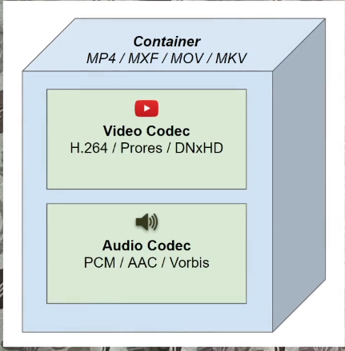

# Section Overview

Basic Concepts of Media

- Image
  - Pixels
  - resolution
  - aspect ratio
- Audio
  - samples
  - bit depth
  - frequency
  - channels
  - tracks
- videos
  - frames
  - frame rate
  - compression

## Terminology related to:

- codec
- container
- thumbnails
- FPS/bitrate
- Overlay
- Subtitles
- Audio extraction and remixing
- other effects

