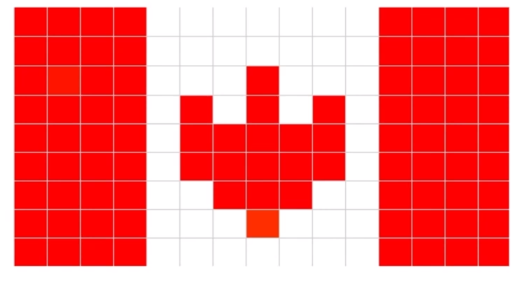
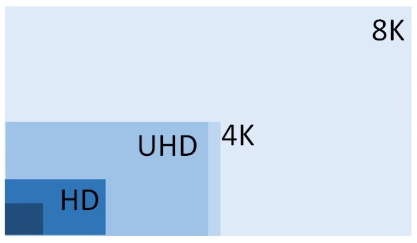
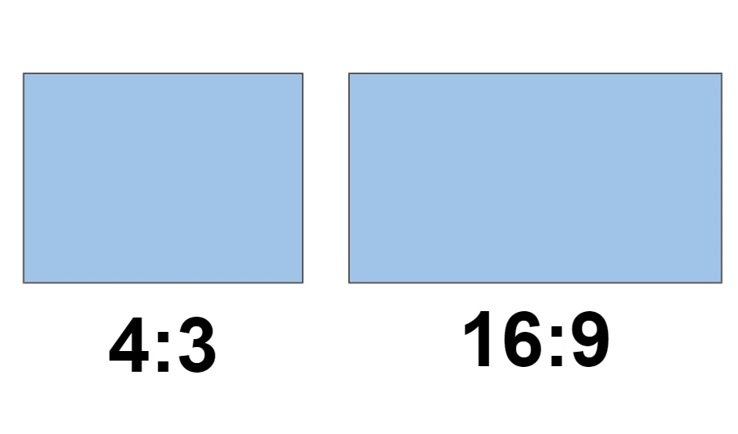
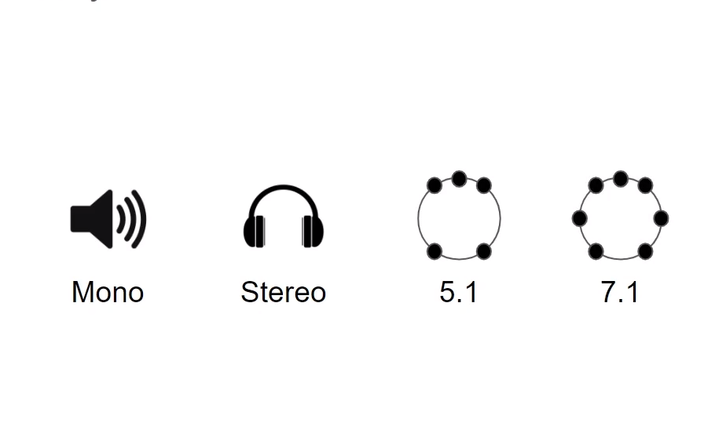
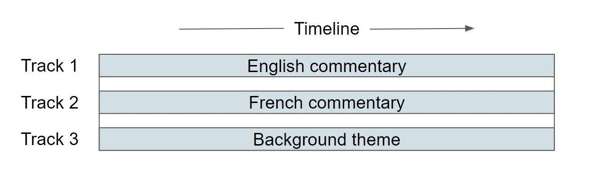
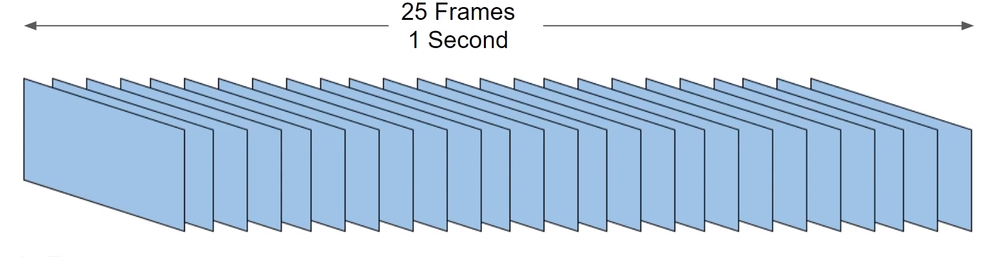

# Fundamentals of Media

Media:
- image
- audio
- video

## Image

### Pixels
- Smallest representation of a point in 2d space
- building block of an image
- has a color - represented in RGB or YUV
- can have transparency information (alpha)

### Image
- collection of pixels
- rectangle
- has width and height

### Image resolution
- represents quality
- denoted as with x height
- HD 1920 x1080 uhd 3840x2160 4KL 4096x2160

### Image Aspect Ratio
- Ratio of width and height
- examples: 16:9, 4:3

---

## Audio
- Sequenence of samples played together
- has a time duration

### Audio Sample
- smallest digital representation of a sound
- building block of an audio
- can be stored as 8/16/24/32 bit value (bit depth)
- more bits -> higher quality audio

### Audio Frequency
- how many samples per second
- examples: 44.1 kHz, 48 kHz
- higher frequency -> higher quality

### Audio Channels
- represents a single sequence of samples
- channels of the same audio track are meant to be played together
- channels can be organized in channel layouts

mono - single channel
stereo - two channels (one left one right channel)
surround channels - 5.1 or 7.1

### Audio Tracks
- organize different sounds that relate to the same timeline 
- may or not may to be used together

## Video
- sequence of images
- has time duration
- each image is called a frame (context)

### Video Frame Rate (FPS)
- frames per second
- examples: 23.98, 24, 25, 29.97, 50, 59.94, 60

### Video Compression
- complex and difficult topic
- works by removing redundant information from the frame of the video
- Spatial redundancy - within a frame
  - nearby pixels do no vary to much so they are encoded using fewer bits
- Temporal redundancy - across frames
  - usually objects are the same between frames
  

## Summary 

- Image
  - Pixels
  - resolution
  - aspect ratio
- Audio
  - samples
  - bit depth
  - frequency
  - channels
  - tracks
- videos
  - frames
  - frame rate
  - compression