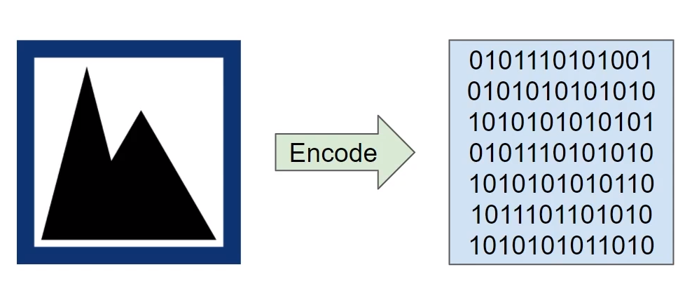
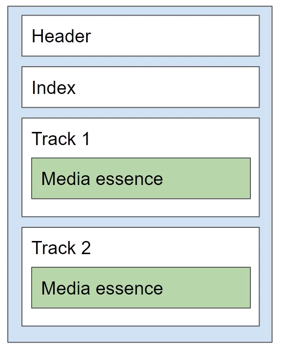
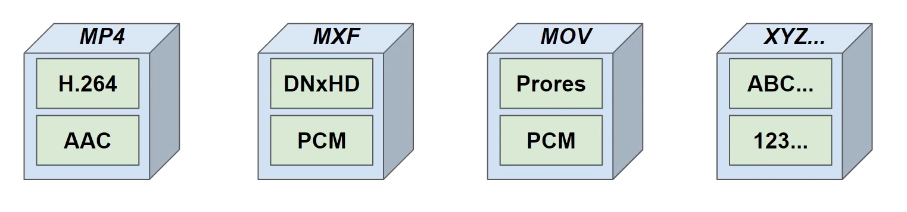

# Codecs and Containers

## What is a codec

- co(der) + dec(oder) = co-dec
- encoding and decoding
- can mean a format of specification, or software library/plugin

## Why encode?
- compression
- smaller file
- less space needed to store
- less bandwidth needed to transfer

## Why decode
- playing back
- editing

## Codec Examples
Video
- H.264 - most common in the web
- H.265 - better compression
- VP9 - youtube - compression plus good quality
- Prores - apple
- DNxHD - avit(?)

Audio
- PCM - not compressed 
- AAC - compressed
- mp3 - compressed

## What is a container
- Package/wrapper for the media essence
- file format
- how the media data is organized inside a file

## Containers Examples
Video (can contain video and audio)
- MP4
- MXF - higher quality
- QT/MOV - 
- MKV

AUDIO (only audio)
- WAV - very popular for storing high quality audio
- M4A - compressed

## Why so many containers?
- some are good for editing purposed
- some are good for compression and decompression, streaming

