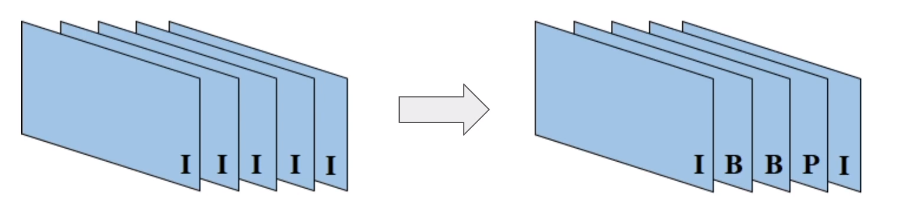
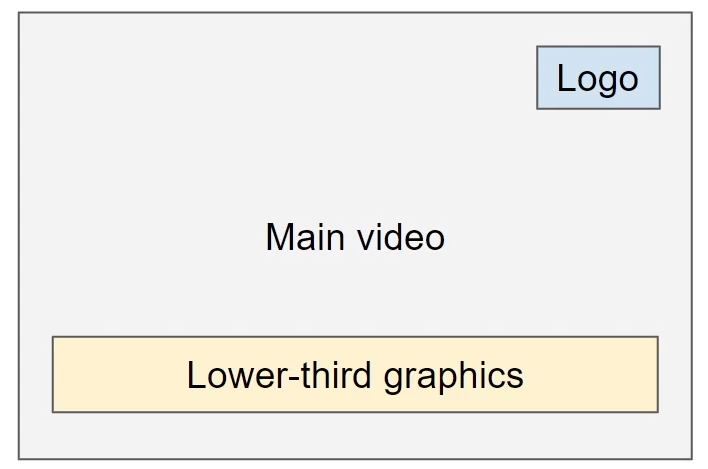
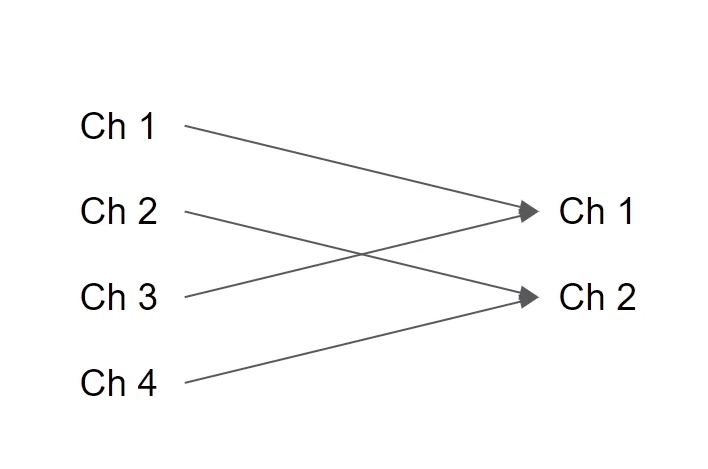
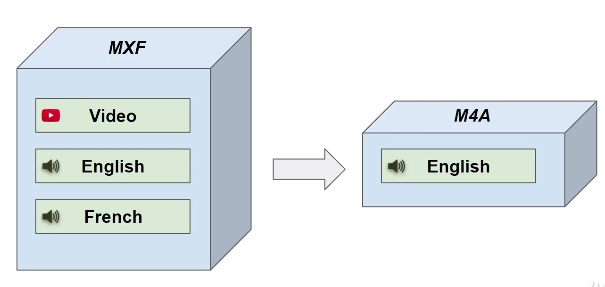
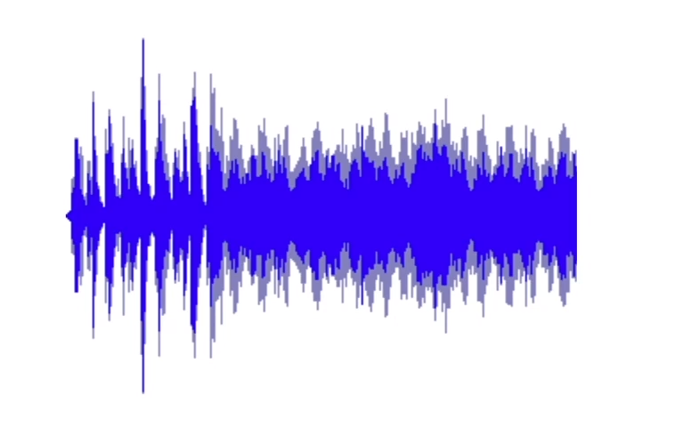

# Transcoding

## What is transcoding?
- from one codec to another
- Example:
  - Prores to H.264

## Why do we need transcode?
- quality
- compression
- storage
- editing / preview / streaming
- consuming application

## Transmuxing
- from one container to another
- Example: MXF -> MP4
- so basically it is  like repacking the content

## Thumbnail generation
- preview image
- search hit
- hover-scrubbing
- poster frame

## Frame rate conversion
- 25FPS - 30 FPS
- support different television standards (PAL/NTSC)
- Higher FPS: preserve slow motion quality for editing
- lower FPS: playback / streaming

## Bitrate conversion
- 50 Mbps -> 2 Mbps
- quality
- storage space
- support different network bandwidths

## Change GOP size
(group of the pictures)
- I-frame only: good for editing
- long GOP - good for compression and streaming

## Overlay
- channel logo
- watermark
- graphics
- lower-third

 

## Subtitles / Captions
- extract embedded subtitles
- burn-in subtitles

## Timecode
- change timecode
- burn-in timecode

## Convert video resolution
- change frame dimensions
- SD, HD, 4k
- bandwidth
- storage space

## Audio volume adjustment
- amplify
- normalize

## audio mixing
- background track, voice
- combine different channels
- stereo for web

## Audio extraction
- multiple languages
- transcription source
- enable audio only download

## Audio resampling
- higher sampling rate during recording
- lower during distribution

## Waveform
- Audio preview
- editing
- playback

## Apply Effects
- flip
- cropping and padding
- color adjustment
- picture in picture
- noise reduction