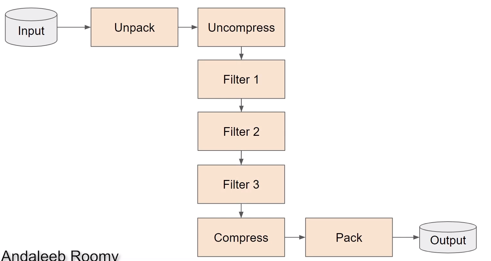
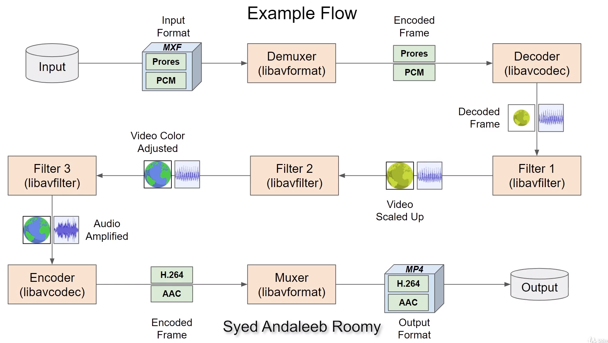

# FFmpeg Architecture

## Basic Process

```
input ----> ffmpeg ------> output

```

## Transcoding

```
input ----> unpack ----> Uncompress ----> Compress ----> Pack ----> Output
            (demux)       (decode)        (encode)       (mux)

```

## Transcoding and Filters




## Example Flow

- in the example bellow decoder is handling video and audio at the same time, but it is just simplification, normally it is separated



