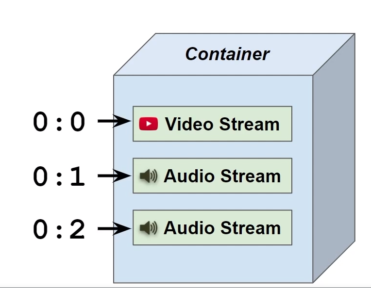

# Stream Selection


## What is a stream?

- video or audio track
- usually one video stream - can be more in theory
- one or more audio streams


## Inspecting streams with the ffprobe

`ffprobe multitrack.mp4 -v error -show_format -show_streams -print_format json`

```json
{
    "streams": [
        {
            "index": 0,
            "codec_name": "h264",
            "codec_long_name": "H.264 / AVC / MPEG-4 AVC / MPEG-4 part 10",
            "profile": "High",
            "codec_type": "video",
            "codec_tag_string": "avc1",
            "codec_tag": "0x31637661",
            "width": 1920,
            "height": 1080,
            "coded_width": 1920,
            "coded_height": 1080,
            "closed_captions": 0,
            "film_grain": 0,
            "has_b_frames": 2,
            "sample_aspect_ratio": "1:1",
            "display_aspect_ratio": "16:9",
            "pix_fmt": "yuv420p",
            "level": 40,
            "chroma_location": "left",
            "field_order": "progressive",
            "refs": 1,
            "is_avc": "true",
            "nal_length_size": "4",
            "id": "0x1",
            "r_frame_rate": "30000/1001",
            "avg_frame_rate": "30000/1001",
            "time_base": "1/30000",
            "start_pts": 0,
            "start_time": "0.000000",
            "duration_ts": 150150,
            "duration": "5.005000",
            "bit_rate": "2695323",
            "bits_per_raw_sample": "8",
            "nb_frames": "150",
            "extradata_size": 46,
            "disposition": {
                "default": 1,
                "dub": 0,
                "original": 0,
                "comment": 0,
                "lyrics": 0,
                "karaoke": 0,
                "forced": 0,
                "hearing_impaired": 0,
                "visual_impaired": 0,
                "clean_effects": 0,
                "attached_pic": 0,
                "timed_thumbnails": 0,
                "captions": 0,
                "descriptions": 0,
                "metadata": 0,
                "dependent": 0,
                "still_image": 0
            },
            "tags": {
                "language": "und",
                "handler_name": "MediaHandler",
                "vendor_id": "[0][0][0][0]"
            }
        },
        {
            "index": 1,
            "codec_name": "aac",
            "codec_long_name": "AAC (Advanced Audio Coding)",
            "profile": "LC",
            "codec_type": "audio",
            "codec_tag_string": "mp4a",
            "codec_tag": "0x6134706d",
            "sample_fmt": "fltp",
            "sample_rate": "44100",
            "channels": 2,
            "channel_layout": "stereo",
            "bits_per_sample": 0,
            "initial_padding": 0,
            "id": "0x2",
            "r_frame_rate": "0/0",
            "avg_frame_rate": "0/0",
            "time_base": "1/44100",
            "start_pts": 0,
            "start_time": "0.000000",
            "duration_ts": 221162,
            "duration": "5.015011",
            "bit_rate": "128362",
            "nb_frames": "217",
            "extradata_size": 5,
            "disposition": {
                "default": 1,
                "dub": 0,
                "original": 0,
                "comment": 0,
                "lyrics": 0,
                "karaoke": 0,
                "forced": 0,
                "hearing_impaired": 0,
                "visual_impaired": 0,
                "clean_effects": 0,
                "attached_pic": 0,
                "timed_thumbnails": 0,
                "captions": 0,
                "descriptions": 0,
                "metadata": 0,
                "dependent": 0,
                "still_image": 0
            },
            "tags": {
                "language": "eng",
                "handler_name": "MediaHandler",
                "vendor_id": "[0][0][0][0]"
            }
        },
        {
            "index": 2,
            "codec_name": "aac",
            "codec_long_name": "AAC (Advanced Audio Coding)",
            "profile": "LC",
            "codec_type": "audio",
            "codec_tag_string": "mp4a",
            "codec_tag": "0x6134706d",
            "sample_fmt": "fltp",
            "sample_rate": "44100",
            "channels": 2,
            "channel_layout": "stereo",
            "bits_per_sample": 0,
            "initial_padding": 0,
            "id": "0x3",
            "r_frame_rate": "0/0",
            "avg_frame_rate": "0/0",
            "time_base": "1/44100",
            "start_pts": 0,
            "start_time": "0.000000",
            "duration_ts": 221162,
            "duration": "5.015011",
            "bit_rate": "128362",
            "nb_frames": "217",
            "extradata_size": 5,
            "disposition": {
                "default": 1,
                "dub": 0,
                "original": 0,
                "comment": 0,
                "lyrics": 0,
                "karaoke": 0,
                "forced": 0,
                "hearing_impaired": 0,
                "visual_impaired": 0,
                "clean_effects": 0,
                "attached_pic": 0,
                "timed_thumbnails": 0,
                "captions": 0,
                "descriptions": 0,
                "metadata": 0,
                "dependent": 0,
                "still_image": 0
            },
            "tags": {
                "language": "eng",
                "handler_name": "MediaHandler",
                "vendor_id": "[0][0][0][0]"
            }
        }
    ],
    "format": {
        "filename": "multitrack.mp4",
        "nb_streams": 3,
        "nb_programs": 0,
        "format_name": "mov,mp4,m4a,3gp,3g2,mj2",
        "format_long_name": "QuickTime / MOV",
        "start_time": "0.000000",
        "duration": "5.015011",
        "size": "1855707",
        "bit_rate": "2960243",
        "probe_score": 100,
        "tags": {
            "major_brand": "isom",
            "minor_version": "512",
            "compatible_brands": "isomiso2avc1mp41",
            "encoder": "Lavf58.45.100"
        }
    }
}
```

## stream Selection
- Required for filters and output (-map)
- Example Extract first audio stream,
- stream selection syntax:

```sh

<input-index>:<stream-type>:<stream-index>

```

## Stream Selection Syntax

- <input-index>
- example: 0, 1, 2
- Implies all streams of the input

```sh

ffmpeg -i background.mp4 -i overlay.png -i sounds.wav ...
                0               1               2
```

## Stream Selection Syntax

- <input-index>:<stream-index>
- example: 0:1, 1:0
- particular stream in the input



## Stream Selection Syntax

- <input-index>:<stream-type>
- example:
  - 0:v
  - 1:a
- implies all streams of that type of the input


 

## Stream Selection Syntax

- <input-index>:<stream-type>:<stream-index>
- example:
  - 0:v:0
  - 1:a:2
- stream index is in reference to the list of streams of specified type only


# Practical Examples:
```sh

# 1 second clip
ffmpeg -v error -y -i multitrack.mp4 -to 1 multitrack-1s.mp4


# note: automatically it would chose one audio stream
ffprobe multitrack-1s.mp4 -v error -show_format -show_streams -print_format json


# With that we are getting all streams - interesting
ffmpeg -v error -y -i multitrack.mp4 -to 1 -map 0 multitrack-1s.mp4

# only video stream
ffmpeg -v error -y -i multitrack.mp4 -to 1 -map 0:v multitrack-1s.mp4

# we can achieve the same (only video stream) by specifying only 0 index
ffmpeg -v error -y -i multitrack.mp4 -to 1 -map 0:0 multitrack-1s.mp4

# only audio
ffmpeg -v error -y -i multitrack.mp4 -to 1 -map 0:a multitrack-1s.mp4

# first audio type stream
ffmpeg -v error -y -i multitrack.mp4 -to 1 -map 0:a:0 multitrack-1s.mp4

# two or more audio file
ffmpeg -v error -y -i multitrack.mp4 -i second-input.mp4 -to 1 -map 1:v:0 -map 0:a:1 multitrack-1s.mp4


```