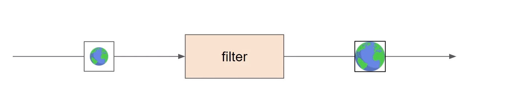
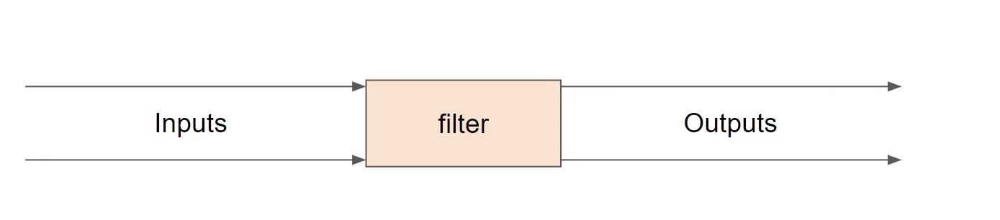
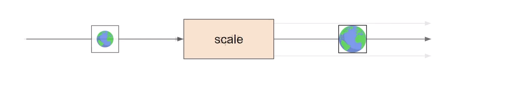
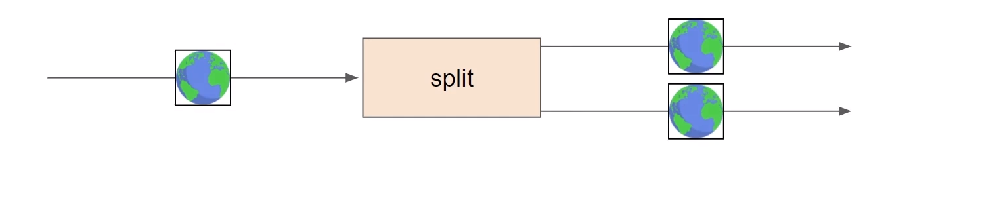
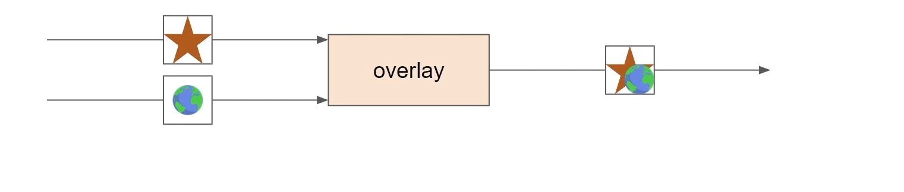
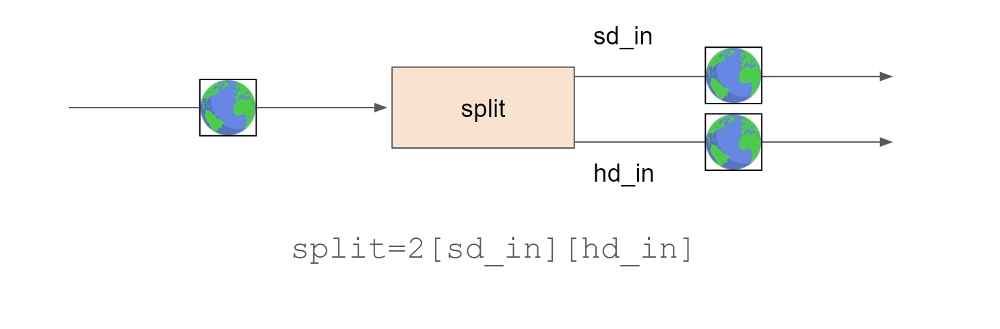
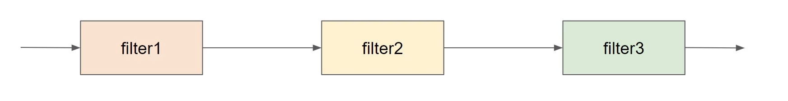

# Filters

## What is a filter?
- changes the media in some way
- usually works on either video or audio
- most common filters come from `libavfilter`

## Filer Options
- affects how the filter works
- key-value pairs or direct value
- sometimes the keys have short names
- syntax:
  - `filter=key1=values1:key2=value2...`
- Example:
  - `scale=width-1920:height=1080`
  - `scale=w=1920:h=1080`
  - `scale=1920:1080`

## Filter inputs or outputs
- one or more inputs and outputs
- inputs and output can be labelled

## Scale - 1 input 1 output

## Sprint - 1 input, 2 outputs

## Overlay - 2 inputs, 1 output

## Labelling inputs and outputs f
- Readable names
- useful for forming non-linear filter graphs
- enclosed in square brackets: [ a_label ]
- stream selector can be used as input labels eg:
  - `[0:v], [1:a:2]` etc
- syntax:
- `[in_1][in_2] ... filter_name=<options..>[out_1][out_2]...`

## Labeling outputs

## LAbeling inputs

## Filter Chain
- Sequence of multiple filters
- each filter connected to the next in the chain
- filters separated with comma ','
- example:
  - `filter1=k11=v11:k22-v22`,`filter2=k21=v22`,filter3=k31=v31:k32=v32

