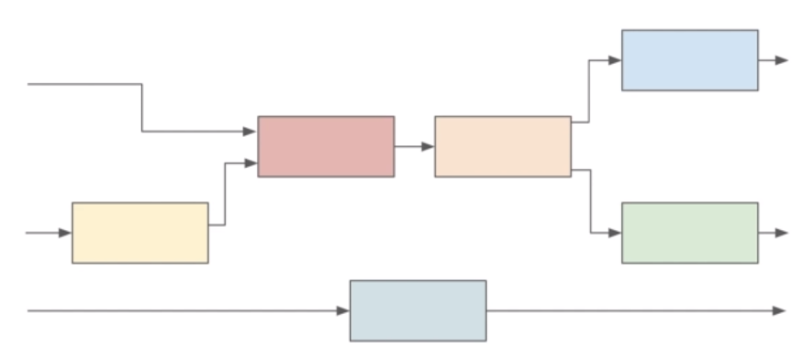
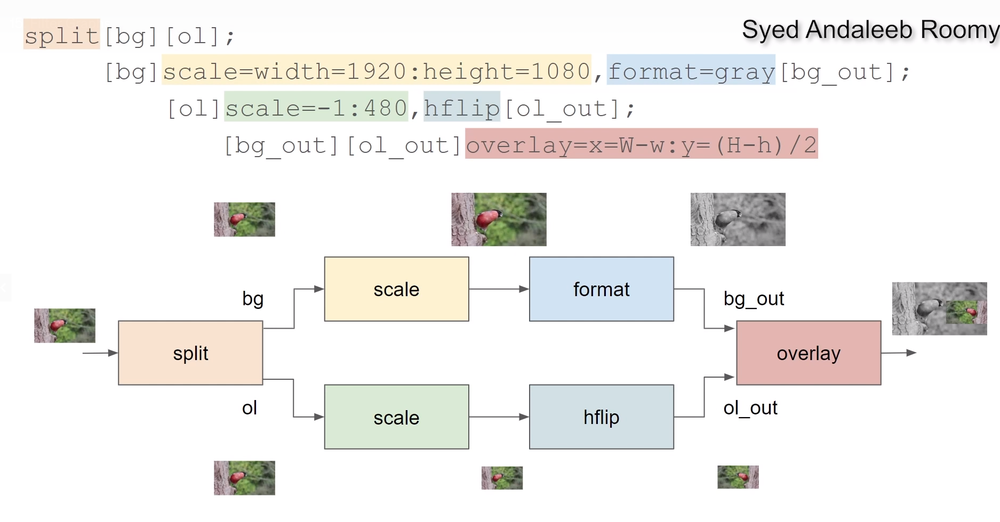
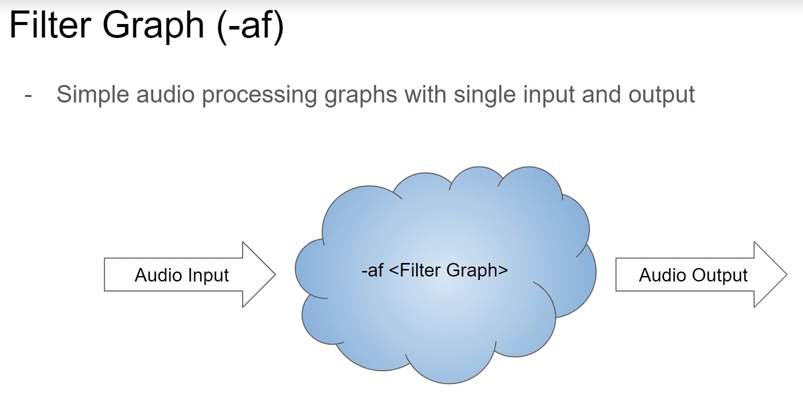
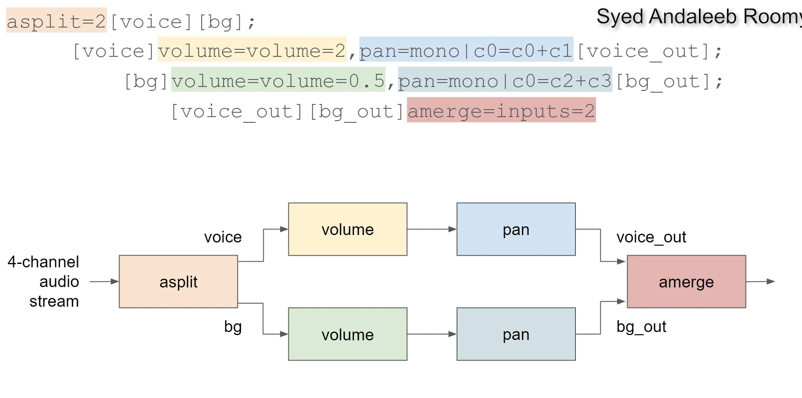
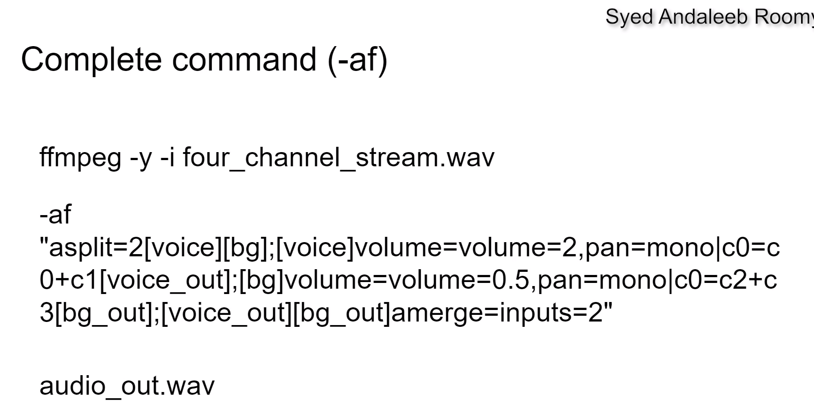
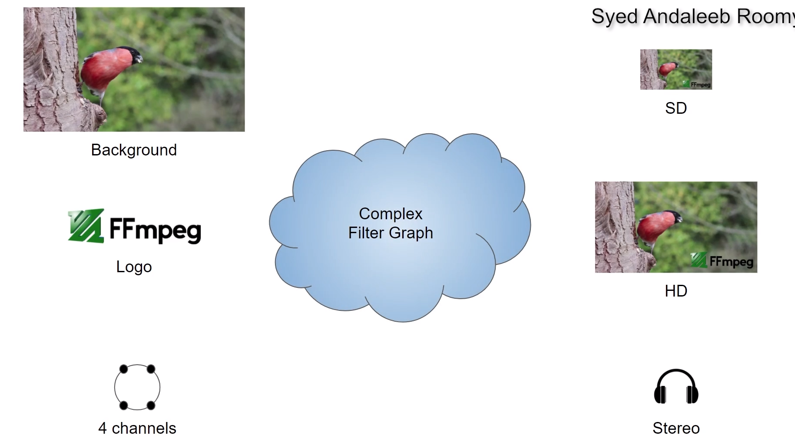
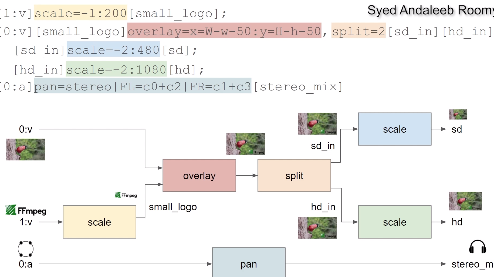

# Filter Graphs

## Filter Graph

- Multiple filter chains
- can be non-linear
- multiple inputs / outputs
- chains separated with semicolon ';'
- can be specified with `-vf`, `-af` or `-filter_complex`

## Filter Graph (`-vf`)
- Simple video processing graphs with single input and output

---

- we labeled outputs in this examples

--- 

Testing:

ffmpeg -v error -y -i bullfinch.mp4 -vf "split[bg][ol];[bg]scale=width=1920:height=1080,format=gray[bg_out];[ol]scale=-1:480,hflip[ol_out];[bg_out][ol_out]overlay=x=W-w:y=(H-h)/2" ol.mp4

ffplay -v error ol.mp4

-----

## AUDIO

## Filter Graph (`-filter_complex`)
- more versatile
- multiple inputs and outputs
- audio and video

## Graph

---

Example:
ffmpeg -y -i four_channel_stream.wav 
    -af "asplit=2[voice][bg];[voice]volume=volume=2,pan=mono|c0=c0+c1[voice_out];[bg]volume=volume=0.5,pan=mono|c0=c2+c3[bg_out];[voice_out][bg_out]amerge=inputs=2" audio_out.wav

ffmpeg -v error -y -i bullfinch.mp4 -i ffmpeg-logo.png 
        -filter_complex "[1:v]scale=-1:200[small_logo];[0:v][small_logo]overlay=x=W-w-50:y=H-h-50,split=2[sd_in][hd_in];[sd_in]scale=-2:480[sd];[hd_in]scale=-2:1080[hd];[0:a]pan=stereo|FL=c0+c2|FR=c1+c3[stereo_mix]" 
        -map "[sd]" sd.mp4 
        -map "[hd]" hd.mp4 
        -map "[stereo_mix]" stereo_mix.mp3