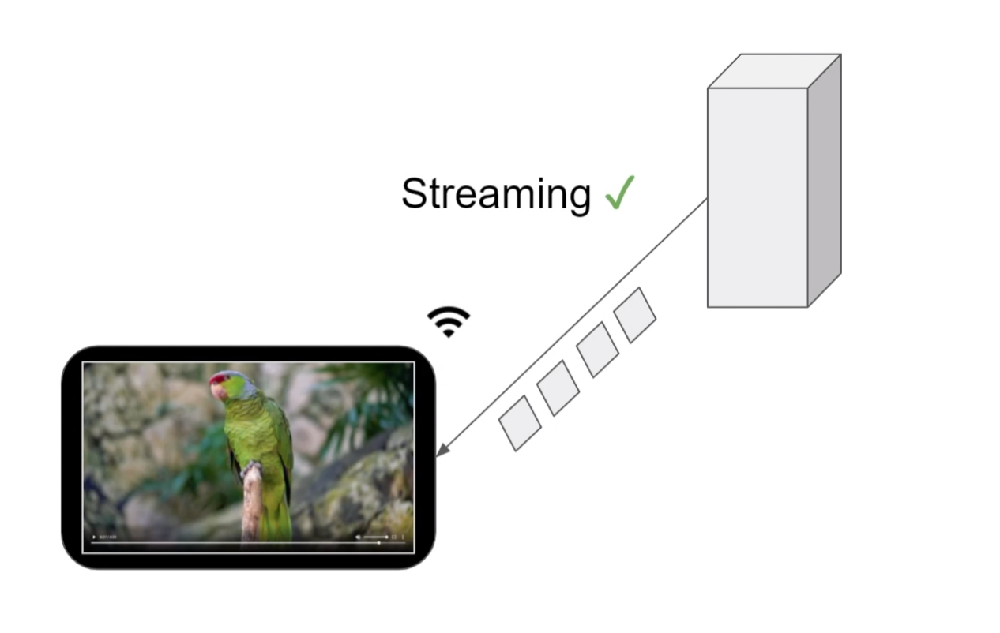
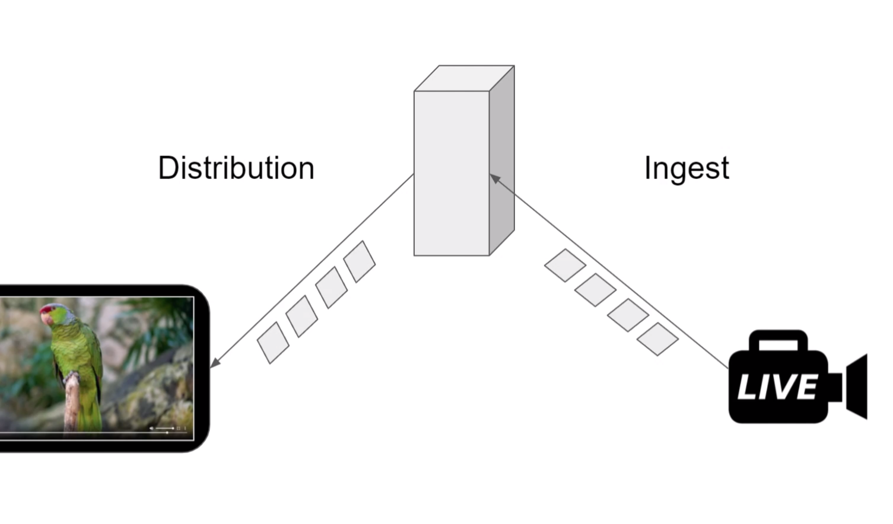

# Introducing to Streaming

## Streaming
- Media is consumable
- over a network
- without waiting for the whole media to be available



Cases:
- it can be pre-recorded video
- when media are being recorded - live


## Ingest and Distribution




## Streaming Playback
- good streaming experience
  - playable instantly - most basic requirements
  - seekable - common expectation
  - adaptive - network speed


---
# Additional to Lecture
---

Introduction to Streaming
-------------------------
The following files have been used in the lecture. The files are all derived from nature.mp4.

--
## File: unstreamable.mp4

Description: Same as nature.mp4. Non-fast-started.

Apache httpd.conf configuration for this file:
<Files "unstreamable.mp4">
  # Non-fast-started
  RequestHeader unset Range
</Files>

--
## File: unseekable.mp4

Description: Can be generated from nature.mp4 by fast-starting it with the following command -
```sh
ffmpeg -y -i nature.mp4 -movflags +faststart -c copy unseekable.mp4
```

Apache httpd.conf configuration for this file:
<Files "unseekable.mp4">
  ## Fast-started
  RequestHeader unset Range
  Header unset "Accept-Ranges"
  Header always set "Accept-Ranges" "none"
</Files>
--

## File: pseudo-seekable.mp4

Description: Can be generated from nature.mp4 by fast-starting it with the following command -
```sh
ffmpeg -y -i nature.mp4 -movflags +faststart -c copy pseudo-seekable.mp4
```

Apache httpd.conf configuration for this file:
<Files "pseudo-seekable.mp4">
  ## Fast-started
  RequestHeader unset Range
</Files>

--

## File: random-seekable.mp4

Description: Can be generated from nature.mp4 by fast-starting it with the following command -
```sh
ffmpeg -y -i nature.mp4 -movflags +faststart -c copy random-seekable.mp4
```

Apache httpd.conf configuration for this file:
<Files "random-seekable.mp4">
  ## Fast-started
  ## No extra configuration needed
</Files>

--

## File: adaptive.m3u8 (and related files)

Description: Can be generated from nature.mp4 with the following command -
```sh
ffmpeg.exe -y -i nature.mp4 -filter_complex "[0:v]split=3[720_in][480_in][240_in];[720_in]scale=-2:720[720_out];[480_in]scale=-2:480[480_out];[240_in]scale=-2:240[240_out]" -map "[720_out]" -map "[480_out]" -map "[240_out]" -map 0:a -map 0:a -map 0:a -b:v:0 3500k -maxrate:v:0 3500k -bufsize:v:0 3500k -b:v:1 1690k -maxrate:v:1 1690k -bufsize:v:1 1690k -b:v:2 326k -maxrate:v:2 326k -bufsize:v:2 326k -b:a:0 128k  -b:a:1 128k  -b:a:2 128k -x264-params "keyint=60:min-keyint=60:scenecut=0"  -var_stream_map "v:0,a:0,name:720p-4M v:1,a:1,name:480p-2M v:2,a:2,name:240p-500k" -hls_list_size 0 -hls_time 2 -hls_segment_filename adaptive-%v-%03d.ts -master_pl_name adaptive.m3u8 adaptive-%v.m3u8
```

Apache httpd.conf configuration for this file:
<Files "adaptive.m3u8">
  ## No extra configuration needed
</Files>
--

## Summary
- streaming: NOT downloading
- ingest
- delivery 
- streaming experience
  - instant start
  - random seek
  - adapting streaming to deal with a network conditions
- cool demos! :> 