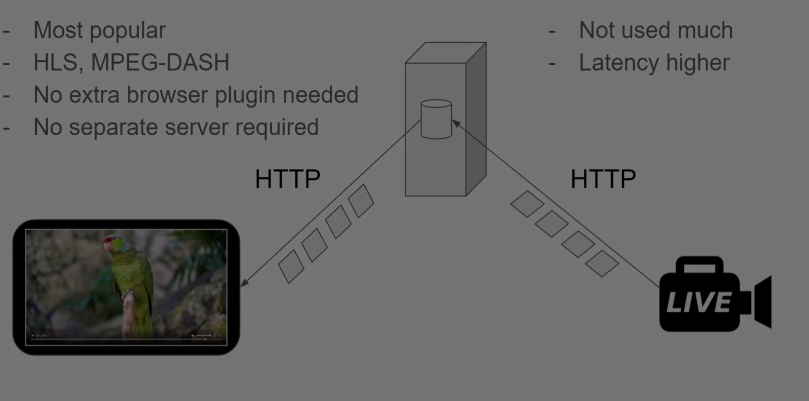

# Streaming Protocols

## Protocols for Streaming

- Main one there is much more
  - rtmp
  - http
  - srt

- some protocols are betters for distriobution some for ingest


## RTMP - Real Time Messaging Protocol
- based on TCP
- Low Latency protocol
- Originally developed by Macromedia (acquired by Adobe)
  - the same company responsible for Adobe Flash Player
  - hugely popular until recently
  - not being updated any more
  - modern codecs not supported


- flash was dropped because of load on the devices and security issues


## HTTP 
- widest reach 
- TCP based
- Unlikely to be blocked anywhere
- no separate streaming server required
- HTLM5  Introduce to browser feature of native playing videos
- MSE (Media Source Extension)
  - more control how media are fetched and send to decode
  - it allow to support HLS, MPEG-DASH
  - JavaScript player



## SRT Secure Reliable Transport
- UDP based
  - faster than tcp because there is no hand shake
- Faster than RTMP
- Reliable on unpredictable networks


## FFmpeg: The Swiss Army Knife of Internet Streaming
### Produce and Consume streams with FFmpeg


```SH
ffplay -v quiet -y 200 "<the-http-url>"

ffmpeg -v quiet -i "<the-http-url>" -vf "scale=-2:200,drawtext=fontfile='c\:/Windows/Fonts/courbd.ttf':text=RTMP:fontsize=30:x=10:y=20:fontcolor=#000000:box=1:boxborderw=5:boxcolor=#ff888888" -vcodec libx264 -f flv rtmp://localhost:1935/live/rtmpdemo

ffplay -v quiet rtmp://localhost:1935/live/rtmpdemo

ffmpeg -v quiet -i rtmp://localhost:1935/live/rtmpdemo -vf "drawtext=fontfile='c\:/Windows/Fonts/courbd.ttf':text=SRT:fontsize=30:x=10:y=60:fontcolor=#000000:box=1:boxborderw=5:boxcolor=#ff888888" -vcodec libx264 -f mpegts srt://localhost:1935?streamid=input/live/srtdemo

ffplay -v quiet srt://localhost:1935?streamid=output/live/srtdemo

ffmpeg -v quiet -i srt://localhost:1935?streamid=output/live/srtdemo -vf "drawtext=fontfile='c\:/Windows/Fonts/courbd.ttf':text=HTTP:fontsize=30:x=10:y=100:fontcolor=#000000:box=1:boxborderw=5:boxcolor=#ff888888" -vcodec libx264 -f dash -method PUT http://localhost/live/httpdemo.mpd

ffplay -v quiet http://localhost/live/httpdemo.mpd

```