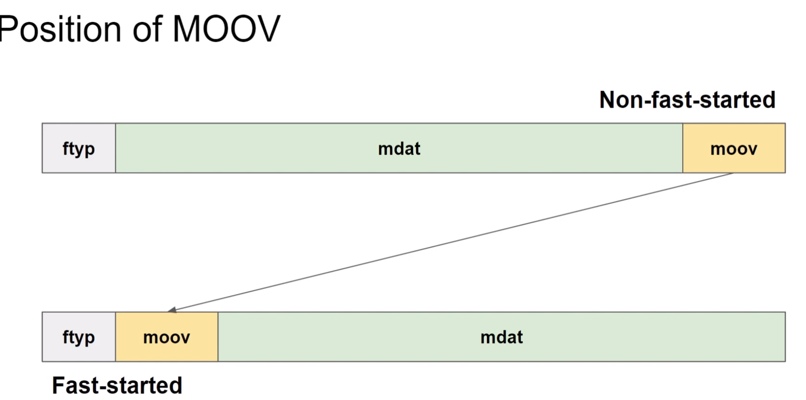
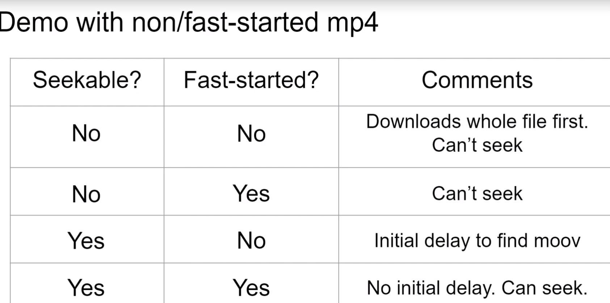

# Progressive Download

## Single-file Media
- not segmented
- Easier to handle
- native browser support (html5 <video> and <audio>)
- copy
- download
  - segmented media can not be easy downloaded
- send to other services


## Container Formats single file 
- MP4
  - most popular container
- WebM
- Ogg

## How playback works
- 1st Step
  - what is the file format?
  - Do I know how to parse the file?
- 2nd Step
  - Is it audio or video or both?
- 3rd
  - What is the video width and height?
- 4rd
  - codecs
- 5th
  - If I have to seek to the 123rd second, where in this file can I find the media data for that particular time?


## The index
-  Lookup table 
   -  where to find media data of a time or frame?
- difficult for the encoder to know the contents of the index beforehand
- that is why it is usually written at the end


## Structure of MP4
- Similar top Apple Quicktime File Format (QT/MOV)
- Hierarchical
- Atom / Box

## Structure of MP4


Fast-started - is called in the case of using mp4 - `fast-started mp4`

## DEMO - Exercise

The following files have been used in the lecture. The files are all derived from nature.mp4.

--
File: seekable-no-fast-started-no.mp4

Description: Same as nature.mp4. Non-fast-started.

Apache httpd.conf configuration for this file:
<Files "seekable-no-fast-started-no.mp4">
  RequestHeader unset Range
  Header set "Accept-Ranges" "none"
</Files>

--
File: seekable-no-fast-started-yes.mp4

Description: Can be generated from nature.mp4 by fast-starting it with the following command -
ffmpeg -y -i nature.mp4 -movflags +faststart -c copy seekable-no-fast-started-yes.mp4

Apache httpd.conf configuration for this file:
<Files "seekable-no-fast-started-yes.mp4">
  RequestHeader unset Range
  Header set "Accept-Ranges" "none"
</Files>

--
File: seekable-yes-fast-started-no.mp4

Description: Same as nature.mp4. Non-fast-started.

Apache httpd.conf configuration for this file:
<Files "seekable-yes-fast-started-no.mp4">
  ## No extra configuration needed
</Files>

--
## Important note!
- this solution is the most efficient because it has the smallest number of request and it is seekable and has implemented fast start - best experience

File: seekable-yes-fast-started-yes.mp4

Description: Can be generated from nature.mp4 by fast-starting it with the following command -
ffmpeg -y -i nature.mp4 -movflags +faststart -c copy seekable-yes-fast-started-yes.mp4

Apache httpd.conf configuration for this file:
<Files "seekable-yes-fast-started-yes.mp4">
  ## No extra configuration needed
</Files>

--


## Demo with non/fast-started mp4



## Questions
- How to check fast-started-ness?
- how to fast-start?
  - tools
  - FFmpeg


ffmpeg -f lavfi -i testsrc=duration=5 test.mp4
ffmpeg -v trace -i test.mp4

ffmpeg -v trace -i test.mp4 2>&1 | grep -e type:\'mdat\' -e type:\'moov\'

Output: (not fast started)
```sh
[mov,mp4,m4a,3gp,3g2,mj2 @ 0x564755e56a80] type:'mdat' parent:'root' sz: 24002 48 26296
[mov,mp4,m4a,3gp,3g2,mj2 @ 0x564755e56a80] type:'moov' parent:'root' sz: 2254 24050 26296

```


ffmpeg -i test.mp4 -movflags +faststart -c copy test-fast-started.mp4


ffmpeg -v trace -i test-fast-started.mp4 2>&1 | grep -e type:\'mdat\' -e type:\'moov\'
Output: (fast started)
```sh
[mov,mp4,m4a,3gp,3g2,mj2 @ 0x562786343a80] type:'moov' parent:'root' sz: 2254 40 26296
[mov,mp4,m4a,3gp,3g2,mj2 @ 0x562786343a80] type:'mdat' parent:'root' sz: 24002 2302 26296

```

ffmpeg -y -f lavfi -i testsrc=duration=5 -movflags +faststart test-2.mp4
```sh
[mp4 @ 0x559fdaa49fc0] Starting second pass: moving the moov atom to the beginning of the fileA    
frame=  125 fps=0.0 q=-1.0 Lsize=      26kB time=00:00:04.88 bitrate=  43.1kbits/s speed=30.7x    
video:23kB audio:0kB subtitle:0kB other streams:0kB global headers:0kB muxing overhead: 9.598633%

```


ffmpeg -v trace -i test-2.mp4 2>&1 | grep -e type:\'mdat\' -e type:\'moov\'

```sh
[mov,mp4,m4a,3gp,3g2,mj2 @ 0x55dfa7d05a80] type:'moov' parent:'root' sz: 2254 40 26296
[mov,mp4,m4a,3gp,3g2,mj2 @ 0x55dfa7d05a80] type:'mdat' parent:'root' sz: 24002 2302 26296

```

## Summary 
- Progressive Download
- Benefits of single-file media
- Structure of MP4 / MOV
- Position of MOOV
- Fast-started vs non-fast-started
- Playback experience
- check atom position with FFmpeg
- Fast-start with FFmpeg