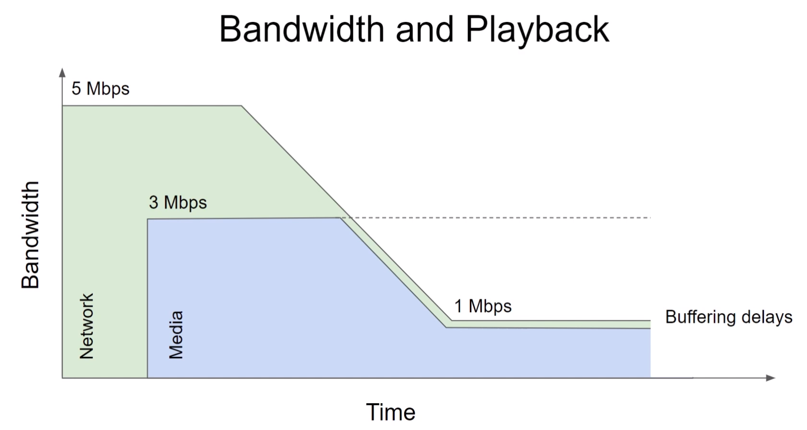
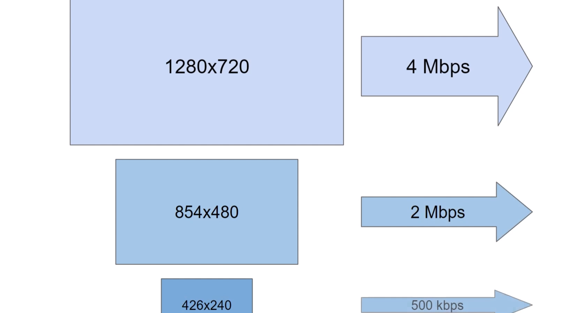
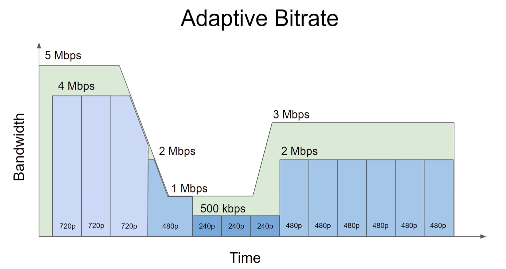
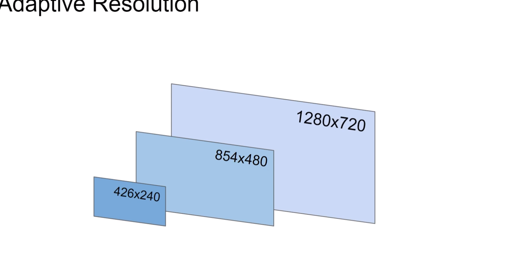

# Adaptive Streaming

## Single-quality media
- only one quality
- single resolution
- bitrate choice

## Speed of the network connection vs single-quality media

## Adaptive Streaming
- multiple qualities (resolution/bitrate)
- player can adapt dynamically based on current conditions
- segmented

## Example of video with 3 quality sources

- so the client needs to finish downloading the segment and then checking if speed/size is enough

## demo
ffprobe -v error seekable-yes-fast-started-yes.mp4 -print_format default=noprint_wrappers=1:nokey=1 -show_entries format=bit_rate

--
File: adaptive.m3u8 (and related files)

Description: Can be generated from nature.mp4 with the following command -
ffmpeg.exe -y -i nature.mp4 -filter_complex "[0:v]split=3[720_in][480_in][240_in];[720_in]scale=-2:720[720_out];[480_in]scale=-2:480[480_out];[240_in]scale=-2:240[240_out]" -map "[720_out]" -map "[480_out]" -map "[240_out]" -map 0:a -map 0:a -map 0:a -b:v:0 3500k -maxrate:v:0 3500k -bufsize:v:0 3500k -b:v:1 1690k -maxrate:v:1 1690k -bufsize:v:1 1690k -b:v:2 326k -maxrate:v:2 326k -bufsize:v:2 326k -b:a:0 128k  -b:a:1 128k  -b:a:2 128k -x264-params "keyint=60:min-keyint=60:scenecut=0"  -var_stream_map "v:0,a:0,name:720p-4M v:1,a:1,name:480p-2M v:2,a:2,name:240p-500k" -hls_list_size 0 -hls_time 2 -hls_segment_filename adaptive-%v-%03d.ts -master_pl_name adaptive.m3u8 adaptive-%v.m3u8

## TS - Transport Stream :>

## Adaptive Resolution

## Summary
- problem with single-quality media
  - playback suffers when bandwidth varies
- Adaptive streaming
  - multiple variants
  - bitrate and resolution
  - segments
  - smarter player
  - adaptation based on bandwidth and display size
