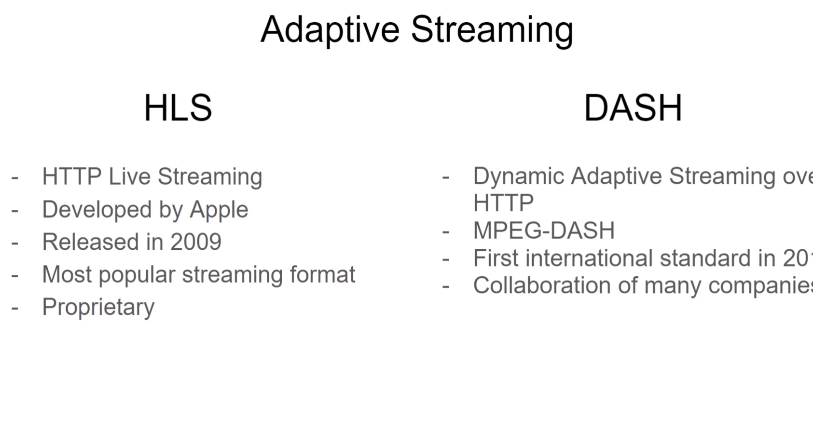
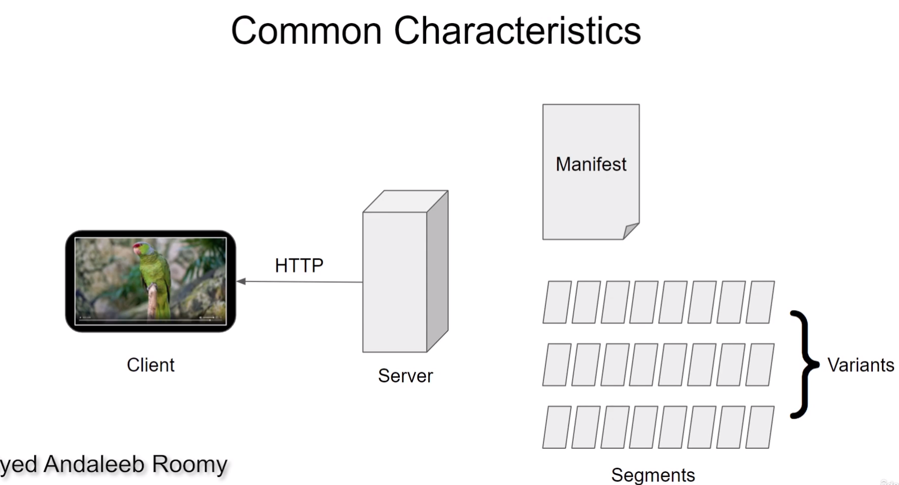
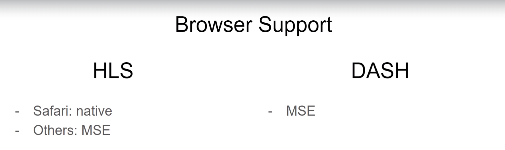
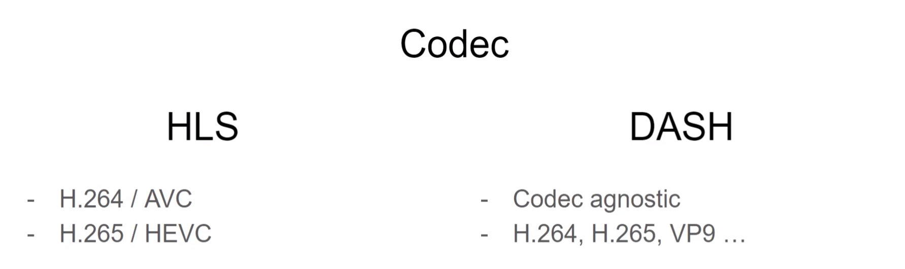
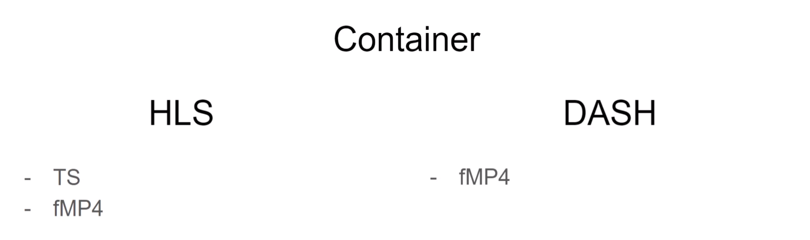
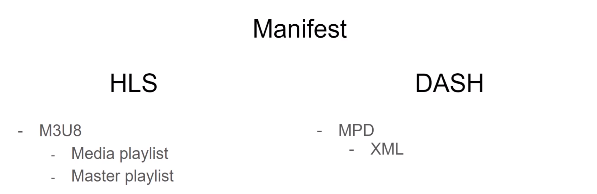

# HLS and DASH

## Common Characteristics

## Codec Support

## Container

fMP4 - fragmented MP4

## Manifests

## Summary
- HLS & DASH
- Proprietary vs standard
- HTTP - common for both
- segments - common
- manifests - common
- examples files - multi-bitrate variants
