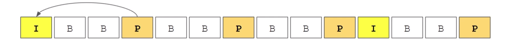
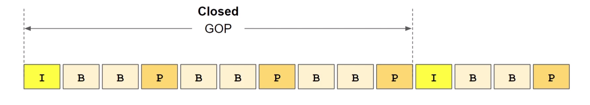
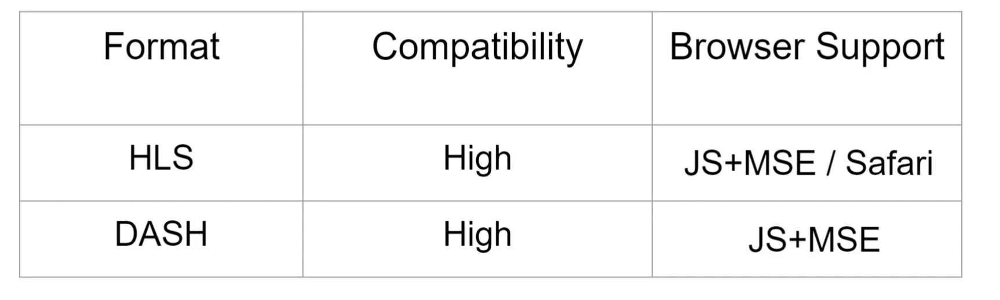

# Encoding Considerations

I - frames - contain all the information and can be decoded in separation to other frames

P - frames - they do not have all information and needs to be decoded following close frames - `predicted pictures`. when there is not many things in video that is changing

B - frames - bidirectional frames - they are even more compressed but to decompress them we need to use their close neighbors

## Group of Pictures - GOP

I - is starting point

## Segments in Adaptive Streaming

## Segments: Switching and Duration

- Long or short segments?
  - to long are not good because you need to finish downloading segments and then you can switch to different segment

## Encoding Efficiency: Short Segments

- You need to have at least one I-frame
  - more I-frames more space so:
  - short Segments => more I-frames => less compression

## Encoding Efficiency: Long Segments

Long Segments -> Fewer I-frames -> better compression

## Segment Duration: Recommendations
- Apple: 6 seconds
- 2-4 seconds work well for most situations

## Codecs

## Containers

## Muxing Audio and Vide
- Muxed together
- we can manage quality of sound too
- separate audio, separate video - different quality etc

## HLS or DASH

## HLS and DASH

Interesting concept of using both 

## Summary
- Frame types - I, P, B
- GOP structures
- Segmentation
  - independence
  - duration
  - encoding efficiency vs switching
- Codecs
- containers
- HLS / DASH
- HLS + DASH with common media segments

