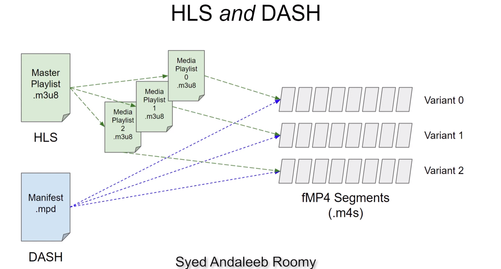

# HLS and DASH with FFmpeg

## Examples
1. HLS, TS, A+V
2. HLS, TS
3. HLS, fMP4
4. DASH, fMP4
5. HLS+DASH, fMP4

## Commands:
HLS & DASH with FFmpeg
----------------------
HLS, TS, A+V:
ffmpeg.exe -y -i ../nature.mp4 -to 10 \
-filter_complex "[0:v]fps=30,split=3[720_in][480_in][240_in];[720_in]scale=-2:720[720_out];[480_in]scale=-2:480[480_out];[240_in]scale=-2:240[240_out]" \
-map "[720_out]" -map "[480_out]" -map "[240_out]" -map 0:a -map 0:a -map 0:a \
-b:v:0 3500k -maxrate:v:0 3500k -bufsize:v:0 3500k \
-b:v:1 1690k -maxrate:v:1 1690k -bufsize:v:1 1690k \
-b:v:2 326k -maxrate:v:2 326k -bufsize:v:2 326k \
-b:a:0 128k \
-b:a:1 96k \
-b:a:2 64k \
-x264-params "keyint=60:min-keyint=60:scenecut=0" \
-var_stream_map "v:0,a:0,name:720p-4M v:1,a:1,name:480p-2M v:2,a:2,name:240p-500k" \
-hls_time 2 \
-hls_list_size 0 \
-hls_segment_filename adaptive-%v-%03d.ts \
-master_pl_name adaptive.m3u8 \
adaptive-%v.m3u8 

HLS, TS:
ffmpeg.exe -y -i ../nature.mp4 -to 10 \
-filter_complex "[0:v]fps=30,split=3[720_in][480_in][240_in];[720_in]scale=-2:720[720_out];[480_in]scale=-2:480[480_out];[240_in]scale=-2:240[240_out]" \
-map "[720_out]" -map "[480_out]" -map "[240_out]" -map 0:a \
-b:v:0 3500k -maxrate:v:0 3500k -bufsize:v:0 3500k \
-b:v:1 1690k -maxrate:v:1 1690k -bufsize:v:1 1690k \
-b:v:2 326k -maxrate:v:2 326k -bufsize:v:2 326k \
-b:a:0 128k \
-x264-params "keyint=60:min-keyint=60:scenecut=0" \
-var_stream_map "a:0,agroup:a128,name:audio-128k v:0,agroup:a128,name:720p-4M v:1,agroup:a128,name:480p-2M v:2,agroup:a128,name:240p-500k" \
-hls_time 2 \
-hls_list_size 0 \
-hls_segment_filename adaptive-%v-%03d.ts \
-master_pl_name adaptive.m3u8 \
adaptive-%v.m3u8 

HLS, fMP4:
ffmpeg.exe -y -i ../nature.mp4 -to 10 \
-filter_complex "[0:v]fps=30,split=3[720_in][480_in][240_in];[720_in]scale=-2:720[720_out];[480_in]scale=-2:480[480_out];[240_in]scale=-2:240[240_out]" \
-map "[720_out]" -map "[480_out]" -map "[240_out]" -map 0:a \
-b:v:0 3500k -maxrate:v:0 3500k -bufsize:v:0 3500k \
-b:v:1 1690k -maxrate:v:1 1690k -bufsize:v:1 1690k \
-b:v:2 326k -maxrate:v:2 326k -bufsize:v:2 326k \
-b:a:0 128k \
-x264-params "keyint=60:min-keyint=60:scenecut=0" \
-var_stream_map "a:0,agroup:a128,name:audio-128k v:0,agroup:a128,name:720p-4M v:1,agroup:a128,name:480p-2M v:2,agroup:a128,name:240p-500k" \
-hls_segment_type fmp4 \
-hls_time 2 \
-hls_list_size 0 \
-hls_fmp4_init_filename adaptive-%v-init.m4s \
-hls_segment_filename adaptive-%v-%03d.m4s \
-master_pl_name adaptive.m3u8 \
adaptive-%v.m3u8 

DASH, fMP4:
ffmpeg.exe -y -i ../nature.mp4 -to 10 \
-filter_complex "[0:v]fps=30,split=3[720_in][480_in][240_in];[720_in]scale=-2:720[720_out];[480_in]scale=-2:480[480_out];[240_in]scale=-2:240[240_out]" \
-map "[720_out]" -map "[480_out]" -map "[240_out]" -map 0:a \
-b:v:0 3500k -maxrate:v:0 3500k -bufsize:v:0 3500k \
-b:v:1 1690k -maxrate:v:1 1690k -bufsize:v:1 1690k \
-b:v:2 326k -maxrate:v:2 326k -bufsize:v:2 326k \
-b:a:0 128k \
-x264-params "keyint=60:min-keyint=60:scenecut=0" \
-seg_duration 2 \
adaptive.mpd

HLS+DASH, fMP4:
ffmpeg.exe -y -i ../nature.mp4 -to 10 \
-filter_complex "[0:v]fps=30,split=3[720_in][480_in][240_in];[720_in]scale=-2:720[720_out];[480_in]scale=-2:480[480_out];[240_in]scale=-2:240[240_out]" \
-map "[720_out]" -map "[480_out]" -map "[240_out]" -map 0:a \
-b:v:0 3500k -maxrate:v:0 3500k -bufsize:v:0 3500k \
-b:v:1 1690k -maxrate:v:1 1690k -bufsize:v:1 1690k \
-b:v:2 326k -maxrate:v:2 326k -bufsize:v:2 326k \
-b:a:0 128k \
-x264-params "keyint=60:min-keyint=60:scenecut=0" \
-hls_playlist 1 \
-hls_master_name adaptive.m3u8 \
-seg_duration 2 \
adaptive.mpd

## Representation of the last command

